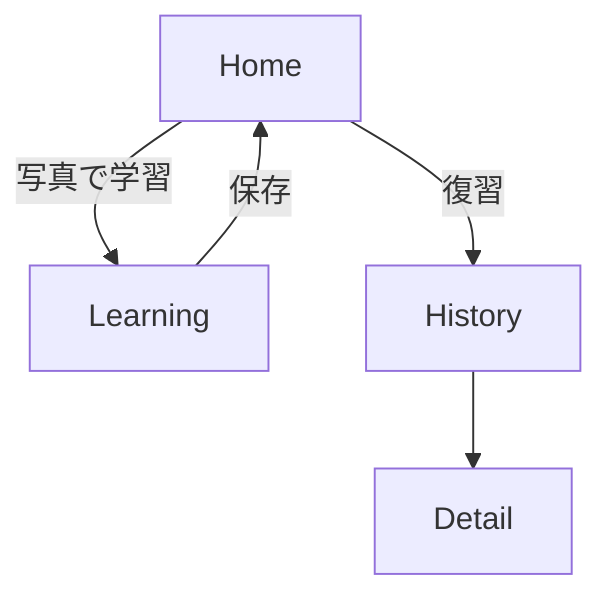
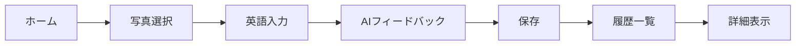

## 📱 アプリ概要

### タイトル案（例）

**「MemoryTalk（メモリートーク）」**
**思い出 × 英語 × AI エージェント添削＆共感**

### コンセプト

> **スマホの思い出写真を使って、自分の感情を英語で表現。AI が添削し、気持ちまで推測してサポートしてくれる共感型英語学習アプリ。**

### 体験イメージ（1 画面完結 UI）

- 上部にユーザー選択の写真
- 写真の下に：「このときの気持ちを英語で伝えてみよう！」
- 入力欄（テキスト）
- 「確認」ボタン

  - AI が：

    - ✅ 添削コメント（良い点＋言い換え例）

- 表現すべてをその写真と紐づけて保存

### ステップ 2：GPT 連携

---

## 🧩 実装したい最低限の機能（MVP）

| 機能                        | 説明                                     | 備考                    |
| --------------------------- | ---------------------------------------- | ----------------------- |
| 1. 写真選択・表示           | カメラロールから 1 枚                    | `expo-image-picker`使用 |
| 2. 感情入力欄               | 英語で自由に表現                         | TextInput               |
| 3. GPT 添削・アドバイス表示 | 「すごくいい！でも〜の方が自然だよ」など | 英語コーチエージェント  |
| 4. データ保存               | 写真＋英語表現（複数）＋日時             | Supabase で保存         |
| 5. 保存履歴の表示           | 過去の学習内容を振り返り可能             | 任意／シンプルで OK     |

---

## 🔧 技術仕様

| 分類           | 使用技術・ツール                                             |
| -------------- | ------------------------------------------------------------ |
| フロント       | React Native（Expo）＋ TypeScript                            |
| UI ライブラリ  | Expo components / カスタム                                   |
| 画像取得       | `expo-image-picker`                                          |
| 英語添削・推論 | OpenAI GPT-4o API                                            |
| 状態管理       | React Hooks（`useState`, `useEffect`）                       |
| データ保存     | Supabase（PostgreSQL + Storage）                             |
| API キー管理   | `.env`で管理（後に Cloud Function 移行可）                   |
| AI 連携関数    | `services/gemini.js`に集約                                   |
| バージョン管理 | Git + GitHub                                                 |
| テスト         | 必須ではないがロジック部分のみ簡易テスト可能（`vitest`など） |

---

## 🛠️ 全体の開発ステップ（段階ごとに整理）

---

### 🔰 ステップ 0：開発環境の準備（所要時間：1〜2 時間）

| 作業                            | 説明                             |
| ------------------------------- | -------------------------------- |
| ✅ Expo CLI のインストール      | `npm install -g expo-cli`        |
| ✅ 新規プロジェクト作成         | `npx create-expo-app MemoryTalk` |
| ✅ GitHub にリポジトリ作成      | バージョン管理と CI 用途         |
| ✅ .env ファイルで API キー管理 | GPT や Supabase 用のキーを保存   |

---

### 🖼️ ステップ 1：基本 UI の構築（3〜4 時間）

| 作業                  | 内容                                | スマホ対応            |
| --------------------- | ----------------------------------- | --------------------- |
| ✅ 画像選択 UI        | expo-image-picker で写真 1 枚を取得 | ✅ Expo Go で確認可能 |
| ✅ 英語入力欄         | TextInput ＋確認ボタン設置          | ✅ スマホで操作可能   |
| ✅ アドバイス表示領域 | 添削コメント・言い換えを表示        | ✅ スマホで確認可能   |

---

### 🤖 ステップ 2：GPT 連携（4〜5 時間）

| 作業                      | 内容                                     | スマホ対応                                |
| ------------------------- | ---------------------------------------- | ----------------------------------------- |
| ✅ GPT API との接続       | fetch()や axios で OpenAI/Gemini に POST | ❌ スマホだけでは無理（API キー管理必要） |
| ✅ 添削＋アドバイスの出力 | Prompt1 で英語コーチ応答生成             | ✅ 表示はスマホで確認可                   |

---

### 🗃️ ステップ 3：データ保存（Supabase）（4〜5 時間）

| 作業                      | 内容                           | スマホ対応                |
| ------------------------- | ------------------------------ | ------------------------- |
| ✅ Supabase セットアップ  | プロジェクト作成・テーブル設計 | ❌ 管理画面操作＝ PC 必須 |
| ✅ 写真 URL／入力文の保存 | insert()で保存                 | ✅ スマホで確認は可能     |
| ✅ 保存データ一覧表示     | 履歴画面の実装                 | ✅ スマホで操作可         |

---

### 🎨 ステップ 4：UI 整備・調整（2〜3 時間）

| 作業                          | 内容                     | スマホ対応             |
| ----------------------------- | ------------------------ | ---------------------- |
| ✅ レイアウト調整             | 上部写真＋下部対話エリア | ✅ スマホ操作で確認 OK |
| ✅ 英語キャラ風アドバイス演出 | 吹き出しやアイコン追加   | ✅ スマホで確認 OK     |

---

### ✅ ステップ 5：MVP 完成・デモ動作確認（1 時間）

| 作業                                  | 内容 |
| ------------------------------------- | ---- |
| ✅ 全画面動作をスマホで通し確認       |      |
| ✅ 表現の保存／履歴確認など検証       |      |
| ✅ 機能単位のコード整理・コメント追加 |      |

---

## 🤖 AI への指示ルール（Prompt 設計＋開発コーディング規約）

### ✏️ GPT への Prompt 設計

#### ① 英語コーチ（添削＋自然な言い換え）

```text
あなたはフレンドリーな英語コーチです。
以下の英文を見て、添削と優しいアドバイスを返してください。

・そのまま使えるなら「完璧！」と返す。
・直したほうが良い場合は、添削後の文＋理由を説明。
・できれば自然な言い換え例も1つください。
```

---

### 🛠️ 命名規則（TypeScript 基準）

| 対象             | 命名規則                                         |
| ---------------- | ------------------------------------------------ |
| 変数名           | `camelCase`（例：`userInput`, `adviceText`）     |
| 関数名           | `camelCase`（例：`handleSubmit`, `fetchAdvice`） |
| コンポーネント名 | `PascalCase`（例：`PhotoPreview`, `AdviceCard`） |
| ファイル名       | `kebab-case.tsx`（例：`photo-preview.tsx`）      |

---

### 💬 コメント・テスト方針

- GPT プロンプトには**意図説明コメント必須**
- 添削ロジックや保存処理など**副作用のある処理には 1 行説明**
- テストコードは時間があれば`adviceFetch()`のレスポンス整形部分に簡易テストを

####UI 機能要件

### 📱 全画面共通

- ステータスバー下からレイアウトを開始する（iPhone の上部バーより下）
- タイトル「MemoryTalk」はすべての画面で左上固定（中央寄り NG）

### 🧠 LearningScreen 要件一覧

- ステップ UI 構成を維持：[📸 写真表示] → [✍️ 入力] → [🧠 フィードバック]
- 画像は aspectRatio: 1 で縦横比を自動調整（見切れ防止）
- 写真は 1000 枚からランダム抽出し、古いものも含まれるように
- 入力フィールドはキーボードに被らないように調整
- タイトルを押すと Home に遷移
- アニメーション付きの写真反転表示（次の写真へ遷移時）
- フィードバックは自然な日本語表現（API 出力前提）
- 設定ボタンは不要

### 📖 HistoryScreen 要件一覧

- ステータスバー下から表示（見切れない）
- タイトル「MemoryTalk」は左上に固定
- 写真をメインとしたグリッド表示（将来対応）
- タップで DetailScreen に遷移

### 🔍 DetailScreen 要件一覧

- タイトル「MemoryTalk」は左上固定
- 詳細情報のテキストや画像を美しく表示
  @@ -242,96 +213,86 @@ YES と言われたら、それを表現する英文を添えてください。

### ユースケース一覧 / 画面遷移図（ユーザーがどう使うか）

| ID  | アクター | ユースケース                                       |
| --- | -------- | -------------------------------------------------- |
| UC1 | ユーザー | 写真を選び英語表現を投稿し AI フィードバックを得る |
| UC2 | ユーザー | 保存された学習履歴を閲覧する                       |



### 業務要件フロー図



### ワイヤーフレーム（どんな見た目か）

#### Home

```
+----------------------+
| MemoryTalk           |
+----------------------+
| [写真で学習する]      |
| [復習する]           |
+----------------------+
#### Learning
```

+----------------------+
| < Home | MemoryTalk |
+----------------------+
| [Photo preview] |
| "気持ちを英語で..." |
| [ TextInput ] |
| [ 確認する ] |
+----------------------+

#### History

```
+----------------------+
| MemoryTalk           |
+----------------------+
| [Photo Grid]         |
+----------------------+
#### Detail
```

+----------------------+
| < Back MemoryTalk |
+----------------------+
| [Photo] |
| [Expression] |
| [AI Feedback] |
+----------------------+

````
### データ構造設計 / アーキテクト図（どう実装するか）

| テーブル      | 主なカラム                         |
|-------------|--------------------------------- |
| photos      | id, uri, created_at               |
| expressions | id, photo_id, text, created_at    |

```mermaid
flowchart LR
    User --> App
    App --> |"画像取得"| MediaLibrary
    App --> |"AI 解析"| Gemini
    App --> |"保存"| Supabase[(DB)]
````

### ER 図（エンティティ・リレーションシップ図）

plaintext
コピーする
編集する
┌─────────────┐ ┌─────────────┐
│ users │ 1 n │ images │
└─────┬───────┘ └─────┬───────┘
│ │
│ │
▼ ▼
┌──────────────────────────────┐
│ learning_histories │
└─────┬───────────────┬────────┘
│ │
│ │
▼ ▼
┌─────────────┐ ┌─────────────┐
│ favorites │ │ reviews │
└─────────────┘ └─────────────┘
users（ユーザー）1 : n images（画像）

images 1 : n learning_histories（学習履歴）

learning_histories 1 : 1 reviews（復習フラグ）

images n : n favorites（お気に入り：ユーザーごと）

## users テーブル

| カラム名   | 型        | 説明           | 制約          |
| ---------- | --------- | -------------- | ------------- |
| id         | uuid      | ユーザー ID    | PK            |
| name       | text      | ユーザー名     |               |
| email      | text      | メールアドレス | Unique        |
| created_at | timestamp | 登録日時       | default=now() |

## images テーブル

| カラム名   | 型        | 説明        | 制約          |
| ---------- | --------- | ----------- | ------------- |
| id         | uuid      | 画像 ID     | PK            |
| user_id    | uuid      | ユーザー ID | FK (users)    |
| image_url  | text      | 画像 URL    |               |
| created_at | timestamp | 登録日時    | default=now() |

## learning_histories テーブル

| カラム名      | 型        | 説明           | 制約          |
| ------------- | --------- | -------------- | ------------- |
| id            | uuid      | 履歴 ID        | PK            |
| user_id       | uuid      | ユーザー ID    | FK (users)    |
| image_id      | uuid      | 画像 ID        | FK (images)   |
| input_text    | text      | 入力した表現   |               |
| feedback_text | text      | 添削内容       |               |
| advice_text   | text      | フィードバック |               |
| learned_at    | timestamp | 学習日時       | default=now() |
| is_review     | boolean   | 復習フラグ     | default=false |
| created_at    | timestamp | 履歴作成日時   | default=now() |

## favorites テーブル

| カラム名                  | 型        | 説明                      | 制約          |
| ------------------------- | --------- | ------------------------- | ------------- |
| id                        | uuid      | お気に入り ID             | PK            |
| user_id                   | uuid      | ユーザー ID               | FK (users)    |
| image_id                  | uuid      | 画像 ID                   | FK (images)   |
| created_at                | timestamp | 登録日時                  | default=now() |
| UNIQUE(user_id, image_id) |           | ユーザーごと画像 1 つまで |               |

## reviews テーブル

| カラム名            | 型        | 説明         | 制約                    |
| ------------------- | --------- | ------------ | ----------------------- |
| id                  | uuid      | レビュー ID  | PK                      |
| learning_history_id | uuid      | 学習履歴 ID  | FK (learning_histories) |
| reviewed_at         | timestamp | 復習した日時 | default=now()           |
