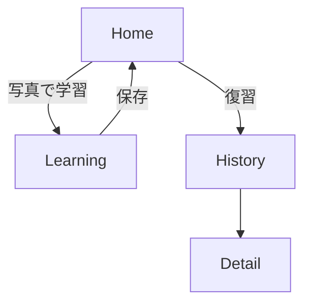
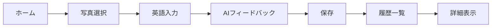
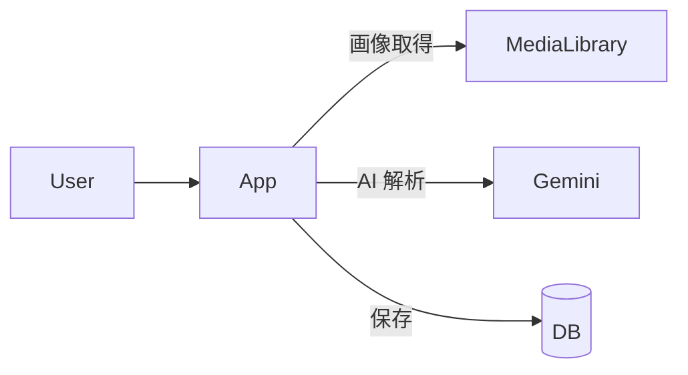

**「MemoryTalk（メモリートーク）」**
**思い出 × 英語 × AIエージェント添削＆共感**

### コンセプト

> **スマホの思い出写真を使って、自分の感情を英語で表現。AIが添削し、気持ちまで推測してサポートしてくれる共感型英語学習アプリ。**

### 体験イメージ（1画面完結UI）

* 上部にユーザー選択の写真
* 写真の下に：「このときの気持ちを英語で伝えてみよう！」
* 入力欄（テキスト）
* 「確認」ボタン

  * AIが：

    * ✅ 添削コメント（良い点＋言い換え例）
    * ✅ フォローアップ提案：「こんな気持ちもあったんじゃない？」
    * ユーザーが「はい」なら追加表現を提示
* 表現すべてをその写真と紐づけて保存

---

## 🧩 実装したい最低限の機能（MVP）

| 機能               | 説明                   | 備考                     |
| ---------------- | -------------------- | ---------------------  |
| 1. 写真選択・表示       | カメラロールから1枚           | `expo-image-picker`使用  |
| 2. 感情入力欄         | 英語で自由に表現             | TextInput              |
| 3. GPT添削・アドバイス表示 | 「すごくいい！でも〜の方が自然だよ」など | 英語コーチエージェント            |
| 4. フォローアップ提案     | 「もしかして〇〇って言いたかった？」   | 推論型エージェント              |
| 5. 「はい」応答処理      | ユーザーがYESで追加表現提示      | UIはボタン想定               |
| 6. データ保存         | 写真＋英語表現（複数）＋日時       | Supabaseで保存            |
| 7. 保存履歴の表示       | 過去の学習内容を振り返り可能       | 任意／シンプルでOK             |

---

## 🔧 技術仕様

| 分類      | 使用技術・ツール                              |
| ------- | ------------------------------------  |
| フロント    | React Native（Expo）＋ TypeScript        |
| UIライブラリ | Expo components / カスタム                |
| 画像取得    | `expo-image-picker`                   |
| 英語添削・推論 | OpenAI GPT-4o API                     |
| 状態管理    | React Hooks（`useState`, `useEffect`）  |
| データ保存   | Supabase（PostgreSQL + Storage）        |
| APIキー管理 | `.env`で管理（後にCloud Function移行可）        |
| バージョン管理 | Git + GitHub                          |
| テスト     | 必須ではないがロジック部分のみ簡易テスト可能（`vitest`など）    |

---

## 🤖 AIへの指示ルール（Prompt設計＋開発コーディング規約）

### ✏️ GPTへのPrompt設計（2種）

#### ① 英語コーチ（添削＋自然な言い換え）

```text
あなたはフレンドリーな英語コーチです。
以下の英文を見て、添削と優しいアドバイスを返してください。

・そのまま使えるなら「完璧！」と返す。
・直したほうが良い場合は、添削後の文＋理由を説明。
・できれば自然な言い換え例も1つください。
```

#### ② フォローアップ提案エージェント（推論的）

```text
ユーザーはこの英文で何か感情を伝えようとしています。
その裏に隠れている可能性のある気持ちや状況を想像し、
「もしかして、こんな気持ちもあったのでは？」という形で1つだけ提案してください。
YESと言われたら、それを表現する英文を添えてください。
```

---

### 🛠️ 命名規則（TypeScript基準）

| 対象       | 命名規則                                          |
| -------- | --------------------------------------------  |
| 変数名      | `camelCase`（例：`userInput`, `adviceText`）      |
| 関数名      | `camelCase`（例：`handleSubmit`, `fetchAdvice`）  |
| コンポーネント名 | `PascalCase`（例：`PhotoPreview`, `AdviceCard`）  |
| ファイル名    | `kebab-case.tsx`（例：`photo-preview.tsx`）       |

---

### 💬 コメント・テスト方針

* GPTプロンプトには**意図説明コメント必須**
* 添削ロジックや保存処理など**副作用のある処理には1行説明**
* テストコードは時間があれば`adviceFetch()`のレスポンス整形部分に簡易テストを


####UI機能要件

### 📱 全画面共通
- ステータスバー下からレイアウトを開始する（iPhoneの上部バーより下）
- タイトル「MemoryTalk」はすべての画面で左上固定（中央寄りNG）

### 🧠 LearningScreen 要件一覧
- ステップUI構成を維持：[📸写真表示] → [✍️入力] → [🧠フィードバック]
- 画像は aspectRatio: 1 で縦横比を自動調整（見切れ防止）
- 写真は1000枚からランダム抽出し、古いものも含まれるように
- 入力フィールドはキーボードに被らないように調整
- タイトルを押すとHomeに遷移
- アニメーション付きの写真反転表示（次の写真へ遷移時）
- フィードバックは自然な日本語表現（API出力前提）
- 設定ボタンは不要

### 📖 HistoryScreen 要件一覧
- ステータスバー下から表示（見切れない）
- タイトル「MemoryTalk」は左上に固定
- 写真をメインとしたグリッド表示（将来対応）
- タップでDetailScreenに遷移

### 🔍 DetailScreen 要件一覧
- タイトル「MemoryTalk」は左上固定
- 詳細情報のテキストや画像を美しく表示
- 余白・カラーリングは一貫性を持たせる
- Homeに戻れるUIを搭載（タイトル押下）

### 🏠 HomeScreen 要件一覧
- タイトル「MemoryTalk」は左上固定（中央寄りNG）
- ボタンは2種：[📸 写真で学習する]／[📖 復習する]
- 全体レイアウトは中央寄せ、読みやすいフォント・配色

※ 各画面とも、人気英語学習アプリのUI/UX（視覚デザイン・色・アニメーション・導線）を参考に常にブラッシュアップを行うこと

---

## 📄 開発ドキュメント

### 要件定義書（何を作るか）
- 写真を題材に英語表現を学ぶアプリ
- ユーザーは写真を選び、感情を英語で投稿する
- AIが表現を添削し共感コメントを返す
- 投稿内容は履歴として保存し、いつでも振り返られる

### 機能要件
| ID  | 要件                                     | 重要度 |
|-----|----------------------------------------|-------|
| FR1 | 写真を選択し英語を入力できる             | 高    |
| FR2 | AI が英文を添削し提案を返す             | 高    |
| FR3 | 投稿を写真とともに保存する               | 高    |
| FR4 | 保存済みの履歴を閲覧・削除できる         | 中    |

### 非機能要件
| 観点             | 要件                                                     | 重要度 |
|------------------|--------------------------------------------------------|-------|
| 可用性           | iOS/Android どちらでも安定して利用できる                 | 高    |
| 性能・拡張性     | 多数の写真でもレスポンスが落ちないようにする             | 中    |
| 運用・保守性     | 依存ライブラリの更新手順を整備し、コードを整理しやすくする | 中    |
| 移行性           | データをバックアップし他環境へ移行できる                 | 低    |
| セキュリティ     | 写真と投稿内容を安全に保存し、認証を必須とする             | 高    |

### ユースケース一覧 / 画面遷移図（ユーザーがどう使うか）

| ID  | アクター | ユースケース                                   |
|----|------|----------------------------------------------|
| UC1 | ユーザー | 写真を選び英語表現を投稿しAIフィードバックを得る |
| UC2 | ユーザー | 保存された学習履歴を閲覧する                     |


### 業務要件フロー図




### ワイヤーフレーム（どんな見た目か）

#### Home
```
+----------------------+
| MemoryTalk           |
+----------------------+
| [写真で学習する]      |
| [復習する]           |
+----------------------+
```

#### Learning
```
+----------------------+
| < Home | MemoryTalk |
+----------------------+
| [Photo preview]      |
| "気持ちを英語で..." |
| [ TextInput ]        |
| [ 確認する ]         |
+----------------------+
```

#### History
```
+----------------------+
| MemoryTalk           |
+----------------------+
| [Photo Grid]         |
+----------------------+
```

#### Detail
```
+----------------------+
| < Back MemoryTalk    |
+----------------------+
| [Photo]              |
| [Expression]         |
| [AI Feedback]        |
+----------------------+
```

### データ構造設計 / アーキテクト図（どう実装するか）

| テーブル      | 主なカラム                         |
|-------------|--------------------------------- |
| photos      | id, uri, created_at               |
| expressions | id, photo_id, text, created_at    |



### スケジュール / バックログ管理（いつ・どう進めるか）

| フェーズ | 期間(目安) | 主なタスク |
|---------|---------|-----------------------------------------------|
| 1. 設計 | 1週目 | 要件整理、画面遷移図・ワイヤーフレーム作成 |
| 2. 実装 | 2-4週目 | アプリ画面実装、AI連携、データ保存 |
| 3. テスト | 5週目 | 動作確認、フィードバック修正 |
| 4. リリース | 6週目 | ストア申請、バックログ整理、次期改善項目の洗い出し |

バックログは GitHub Issues で管理し、週次で進捗レビューを行う。
